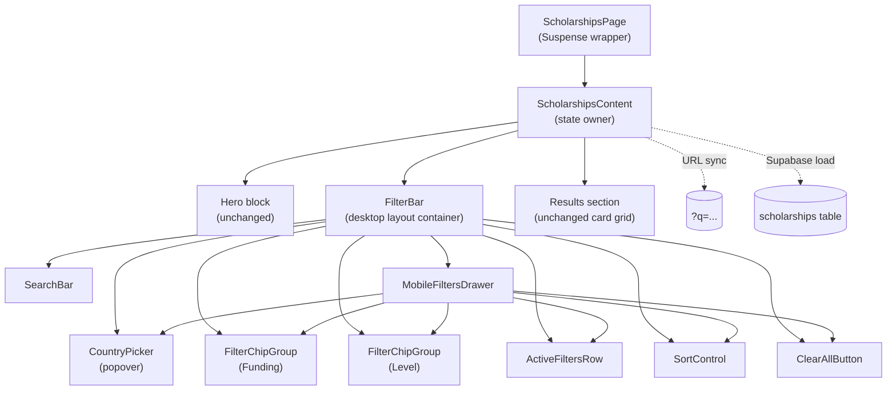
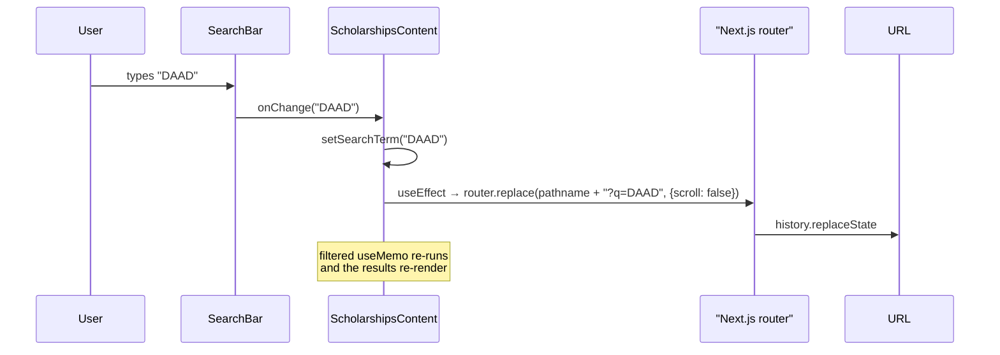

# Design Document

## Overview

This design redesigns the search and filter UI of the public `/scholarships` page (`apps/web/src/app/scholarships/page.tsx`) into a modern, themed experience built from small, dependency-free React components. The redesign keeps the existing Next.js App Router client component architecture, the Supabase fetch, the `FUNDING_MAP`/`LEVEL_MAP` translations, the bookmark/view-details flow, and the `filtered` `useMemo` predicate intact. It adds:

- A polished search bar with a leading icon, focus ring, and clear-input button.
- Chip-based filter controls for the Funding and Level facets.
- A popover-based Country picker (because country lists can be long).
- A row of active-filter chips with per-chip removal.
- A redesigned sort control.
- A result count and clear-all button.
- A mobile drawer that holds the facet controls on small viewports.
- URL sync of the `q` query parameter (which is currently read from the URL but never written back).

All visual styling is built from the theme tokens already declared in `apps/web/src/app/globals.css` (teal/coral/sand/ink/sky scales, `--shadow`, `--font-display`, `--font-body`). No new global UI primitive library is introduced; new components live colocated under `apps/web/src/app/scholarships/components/`. The implementation uses only React + Next.js + plain CSS modules — no Radix, no shadcn, no headless UI dependency is added.

### Goals

- Visual modernization that matches the rest of the BairePorbo theme.
- Strict functional parity with the existing filter/sort behavior.
- Full keyboard and screen-reader accessibility (chips, popover, drawer).
- A small, focused component decomposition that keeps `ScholarshipsContent` thin without leaking implementation across the codebase.

### Non-Goals

- Replacing the data layer or the bookmark API.
- Changing the result card layout, deadline badge logic, or the AI panel on the detail page.
- Adding any new filter facets, sort options, or persistence beyond `?q=`.
- Refactoring the admin scholarships UI (explicitly out of scope per requirements).

## Architecture

### High-level structure

The `/scholarships` page remains a single Next.js client component (`"use client"`) wrapped in `<Suspense>` (required because it calls `useSearchParams`). The current monolithic `ScholarshipsContent` is split into a thin orchestrator that owns the canonical filter state plus a small set of focused subcomponents that own their own UI-only state.



The same `CountryPicker`, `FilterChipGroup`, `ActiveFiltersRow`, `SortControl`, and `ClearAllButton` subtrees are rendered on the desktop layout and inside the `MobileFiltersDrawer` — they accept the filter state via props, so there is exactly one source of truth even though they have two render sites.

### State ownership

| State | Lives in | Why |
| --- | --- | --- |
| `scholarships`, `loading` | `ScholarshipsContent` | Single Supabase fetch, shared across all subcomponents and the hero panel. |
| `searchTerm`, `selectedCountries`, `selectedFunding`, `selectedLevels`, `sortBy` | `ScholarshipsContent` | Canonical filter state; drives URL sync, drives the `filtered` `useMemo`, and is read by every subcomponent. |
| `bookmarkedIds`, `bookmarkingId` | `ScholarshipsContent` | Unrelated to this redesign; preserved as-is. |
| `isCountryOpen`, country-popover element refs | `CountryPicker` | UI-only, no other component needs to know. |
| `isDrawerOpen` | `FilterBar` (or `ScholarshipsContent` if simpler) | Toggled by the "Filters" mobile button; drives the drawer overlay. The active-filter count badge derives from props, not local state. |

Setters (`setSearchTerm`, `setSelectedCountries`, etc.) are passed down. To keep prop signatures tidy, `FilterBar` accepts a single `filters` object plus a single `onChange` callback (or individual setters) — see Components and Interfaces below for the chosen shape.

### URL sync (`q` parameter)

The current code reads `q` on mount but never writes it. The redesign adds a write-side `useEffect` in `ScholarshipsContent` that mirrors `searchTerm` to the URL using `router.replace` (not `router.push`) so typing into the search box does not flood the back-button history.



Implementation details:

- The effect is debounced lightly (e.g. 200ms via `setTimeout` cleanup) to avoid a `history.replaceState` call on every keystroke. A debounce is acceptable because the URL is a side effect of the input value, not the source of truth for filtering.
- The effect uses `router.replace` from `next/navigation` (per `node_modules/next/dist/docs/01-app/03-api-reference/04-functions/use-router.md`) with `{ scroll: false }` to preserve the user's scroll position.
- When `searchTerm` is empty, the `q` parameter is removed from the URL by building a fresh `URLSearchParams` from the current `useSearchParams()` snapshot, deleting `q`, and replacing with the resulting path.
- Initial load reads `q` from `useSearchParams()` exactly as today; this stays as the initializer for `useState`, so back/forward navigation that re-mounts the component will still seed correctly.

### Filter and sort logic

The filter+sort `useMemo` block in the current `page.tsx` is preserved verbatim in behavior. To make it independently testable and reusable from both the page and any property tests, its body is extracted into a pure helper:

```ts
// apps/web/src/app/scholarships/lib/filterAndSort.ts
export type FilterState = {
  searchTerm: string;
  selectedCountries: string[];
  selectedFunding: string[];
  selectedLevels: string[];
  sortBy: "Best match" | "Deadline" | "Funding";
};

export function filterAndSortScholarships(
  scholarships: Scholarship[],
  state: FilterState,
): Scholarship[] { /* identical logic to today's useMemo */ }
```

`ScholarshipsContent` then calls `useMemo(() => filterAndSortScholarships(scholarships, state), [...])`. This is a *pure refactor*: no behavior change, but it becomes the unit-of-property-testing.

### Responsive strategy

The 820px breakpoint already used in `scholarships.module.css` continues to define `Small_Viewport`. The implementation is CSS-driven (not JS-driven) so the layout is correct on the first paint without a `window.matchMedia` flash:

- `> 820px`: facet controls render inline inside the `.filters` container; the "Filters" mobile button is hidden via CSS.
- `≤ 820px`: facet controls inside the inline `.filters` container are hidden via CSS; the "Filters" button is shown; activating it opens `MobileFiltersDrawer`, which mounts the same facet subtree.

The Search_Bar and the Result_Count remain visible on the page outside the drawer at every viewport (per Requirement 8.5).

## Components and Interfaces

All new component files live under `apps/web/src/app/scholarships/components/`. They are client components (the page is already `"use client"`).

### File layout

```
apps/web/src/app/scholarships/
├── page.tsx                              # ScholarshipsPage + ScholarshipsContent (slimmer)
├── scholarships.module.css               # extended with new classes (see CSS strategy)
├── lib/
│   └── filterAndSort.ts                  # pure filter/sort helper (extracted)
└── components/
    ├── filter-bar.tsx                    # desktop-vs-mobile layout container
    ├── search-bar.tsx                    # icon, input, clear button
    ├── filter-chip.tsx                   # single toggle pill
    ├── filter-chip-group.tsx             # row of FilterChips for one facet
    ├── country-picker.tsx                # popover trigger + panel
    ├── active-filters-row.tsx            # row of removable Active_Filter_Chips
    ├── sort-control.tsx                  # styled select
    ├── clear-all-button.tsx              # "Clear all" button (or merged into FilterBar)
    ├── mobile-filters-drawer.tsx         # role=dialog drawer
    └── use-focus-trap.ts                 # small reusable hook used by the drawer
```

This list is the canonical "files to be added" set (see "Files to Be Added vs Modified" at the end). Files smaller than ~30 lines (e.g. `clear-all-button.tsx`) MAY be inlined into their parent if doing so keeps the parent under ~120 lines; the design treats them as logical units regardless.

### Component contracts

#### `SearchBar`

```tsx
type SearchBarProps = {
  value: string;
  onChange: (next: string) => void;
  placeholder?: string;
};
```

Renders a `<div role="search">` containing a leading SVG icon, an `<input type="text">`, and a trailing `<button>` rendered only when `value.length > 0`. The input is associated with a screen-reader-only `<label>` ("Search scholarships"). The clear button has `aria-label="Clear search"`. After clearing, focus is returned to the input via a `ref` and `inputRef.current?.focus()`.

#### `FilterChip`

```tsx
type FilterChipProps = {
  label: string;
  pressed: boolean;
  onToggle: () => void;
};
```

Renders a `<button type="button" aria-pressed={pressed}>` with the chip label. Active state is `aria-pressed="true"` and applies the `.filterChipActive` style.

#### `FilterChipGroup`

```tsx
type FilterChipGroupProps = {
  legend: string;             // e.g. "Funding"
  options: string[];
  selected: string[];
  onToggle: (value: string) => void;
};
```

Renders a `<fieldset>` with `<legend>` (for screen-reader semantics) and a row of `FilterChip`s. Hidden entirely when `options.length === 0` (Requirement 2.12). Renders the single chip when `options.length === 1` (Requirement 2.13).

#### `CountryPicker`

```tsx
type CountryPickerProps = {
  options: string[];          // available countries
  selected: string[];
  onToggle: (value: string) => void;
};
```

A trigger button + popover. The trigger is a `<button>` whose label is `"Country"` plus a count badge when `selected.length > 0`. The trigger has `aria-haspopup="listbox"`, `aria-expanded={isOpen}`, and `aria-controls={panelId}` (Requirement 9.4).

The popover panel has `role="dialog"` (it is interactive and modal-like), `aria-label="Country filter"`, and the panel id matches `aria-controls` on the trigger. Inside the panel, each option is a `FilterChip`-styled toggle button so multi-select works without closing on each click (Requirement 2.8).

Mechanics:
- **Open**: trigger click or keyboard activation (Enter/Space). Focus moves to the first option button.
- **Close on outside click**: a `mousedown` listener on `document` that closes when the event target is outside both the panel and the trigger.
- **Close on Escape**: a `keydown` listener while open; on Escape, close and `triggerRef.current?.focus()` to return focus to the trigger (Requirement 9.5).
- **Tab cycling**: keep tab order natural inside the panel (the panel contains only the option buttons and a close affordance). The popover is *not* a strict focus trap (this is a non-modal popover); a strict trap would prevent the user from tabbing back to the page, which we want them to be able to do. Escape returns focus, which satisfies the spirit of the requirement. (See "Accessibility implementation" below for why this differs from the drawer.)

Positioning: absolute positioning relative to the trigger, anchored to the bottom-left of the trigger with `top: calc(100% + 8px); left: 0`. On overflow at the right edge of the viewport, the CSS uses `right: 0; left: auto` via a media query for very narrow desktop windows. This is intentionally a simple positioning strategy — no `Popper`/`floating-ui` dependency.

#### `ActiveFiltersRow`

```tsx
type ActiveFiltersRowProps = {
  searchTerm: string;
  selectedCountries: string[];
  selectedFunding: string[];
  selectedLevels: string[];
  onRemoveSearch: () => void;
  onRemoveCountry: (value: string) => void;
  onRemoveFunding: (value: string) => void;
  onRemoveLevel: (value: string) => void;
};
```

Renders nothing when all four selections are empty (Requirement 3.5). Otherwise renders a row of pill chips, each with a label (e.g. `"Country: Germany"`) and a `<button aria-label="Remove filter Germany">×</button>`. The search-term chip uses a label like `"Search: \"DAAD\""`.

Removing a country/funding/level chip calls the matching toggle setter on the parent (so removal is the exact inverse of adding via a `FilterChip`). Removing the search chip clears `searchTerm` only.

#### `SortControl`

```tsx
type SortControlProps = {
  value: "Best match" | "Deadline" | "Funding";
  onChange: (next: SortControlProps["value"]) => void;
};
```

Renders a `<label>Sort by <select>...</select></label>` styled with the chip border tokens. Uses native `<select>` for full keyboard support, screen-reader announcement, and zero dependencies (Requirement 4.5). The wrapper element gets the rounded container; the `<select>` itself is styled to match (custom chevron via background-image).

#### `MobileFiltersDrawer`

```tsx
type MobileFiltersDrawerProps = {
  open: boolean;
  onClose: () => void;
  children: ReactNode;        // the facet subtree (CountryPicker + chip groups + sort + clear)
  activeFilterCount: number;  // for the dialog title's count summary
};
```

Renders a backdrop + sliding panel when `open` is `true`. The panel has:
- `role="dialog"`, `aria-modal="true"`, `aria-labelledby={titleId}`.
- A header row with the title `"Filters"` and a close button (`aria-label="Close filters"`).
- A body containing `children`.
- A footer with a "Show results" button that just calls `onClose`.

Mechanics (Requirements 8.4, 9.8):
- **Open**: `useEffect` runs when `open` flips to `true`. It (a) records `document.activeElement` as the previously focused element, (b) sets `document.body.style.overflow = "hidden"` to lock scroll, (c) focuses the close button.
- **Escape**: a `keydown` listener on the panel calls `onClose`.
- **Backdrop click**: clicking the backdrop calls `onClose`. Clicks inside the panel `stopPropagation`.
- **Focus trap**: a `useFocusTrap` hook attaches a `keydown` listener that intercepts Tab and Shift+Tab to wrap focus between the first and last tabbable element inside the panel. (See implementation sketch below.)
- **Close**: `onClose` flips `open` to `false`. A cleanup effect restores `document.body.style.overflow` and calls `previouslyFocused.focus()` to return focus to the "Filters" toggle button.

```ts
// use-focus-trap.ts (sketch)
export function useFocusTrap(containerRef: RefObject<HTMLElement>, active: boolean) {
  useEffect(() => {
    if (!active || !containerRef.current) return;
    const container = containerRef.current;
    const handleKeyDown = (e: KeyboardEvent) => {
      if (e.key !== "Tab") return;
      const focusable = container.querySelectorAll<HTMLElement>(
        'a[href], button:not([disabled]), input:not([disabled]), select:not([disabled]), textarea:not([disabled]), [tabindex]:not([tabindex="-1"])'
      );
      if (focusable.length === 0) return;
      const first = focusable[0];
      const last = focusable[focusable.length - 1];
      if (e.shiftKey && document.activeElement === first) {
        e.preventDefault();
        last.focus();
      } else if (!e.shiftKey && document.activeElement === last) {
        e.preventDefault();
        first.focus();
      }
    };
    container.addEventListener("keydown", handleKeyDown);
    return () => container.removeEventListener("keydown", handleKeyDown);
  }, [active, containerRef]);
}
```

#### `FilterBar`

```tsx
type FilterBarProps = {
  // data
  countries: string[];
  fundingOptions: string[];
  levelOptions: string[];
  resultCount: number;
  // filter state
  searchTerm: string;
  selectedCountries: string[];
  selectedFunding: string[];
  selectedLevels: string[];
  sortBy: "Best match" | "Deadline" | "Funding";
  // setters
  onSearchTermChange: (next: string) => void;
  onToggleCountry: (value: string) => void;
  onToggleFunding: (value: string) => void;
  onToggleLevel: (value: string) => void;
  onSortByChange: (next: SortControlProps["value"]) => void;
  onClearAll: () => void;
};
```

The container that lays out the filter section. It owns `isDrawerOpen` (since the drawer toggle button lives here) and renders:

1. The `SearchBar` (always visible).
2. On desktop (CSS `@media (min-width: 821px)`): the `CountryPicker`, two `FilterChipGroup`s, `ActiveFiltersRow`, the result count, the `SortControl`, and the `ClearAllButton` inline.
3. On mobile (CSS `@media (max-width: 820px)`): a "Filters" button with a numeric badge, plus the `SortControl` outside the drawer (alternative: inside the drawer; design picks *outside the drawer*, above the results, per Requirement 8.6 — keeping it accessible on mobile without opening the drawer is the simpler UX). The `MobileFiltersDrawer` mounts the facet subtree on demand.

The "Filters" button's badge equals `selectedCountries.length + selectedFunding.length + selectedLevels.length` (Requirement 8.7).

### Updated `ScholarshipsContent`

After the refactor, `ScholarshipsContent` shrinks to:

1. The Supabase fetch effect (unchanged).
2. The bookmark fetch effect (unchanged).
3. State declarations (unchanged in shape).
4. The `q` URL sync effect (new; described above).
5. The derived `countries`, `fundingOptions`, `levelOptions` `useMemo`s (unchanged).
6. The `filtered` `useMemo` calling `filterAndSortScholarships` (extracted body, identical behavior).
7. `clearFilters`, `formatDeadline`, `isClosingSoon`, `toggleBookmark` (unchanged).
8. JSX:
   - `<AppNavbar>` (unchanged).
   - `<section className={styles.hero}>` (unchanged).
   - `<FilterBar ... />` replacing today's `.filters` section.
   - `<section className={styles.results}>` (largely unchanged; the `.resultsHeader` no longer renders the inline `<select>` — that is moved to `FilterBar`/`SortControl`. But the desktop `<SortControl>` may still be rendered next to the results header; see "CSS strategy" below).

## Data Models

No backing data model changes. The `Scholarship` type, the `scholarships` Supabase table, the `FUNDING_MAP`, `LEVEL_MAP`, and `FUNDING_PRIORITY` constants are unchanged.

The new types introduced are purely view-model:

```ts
// apps/web/src/app/scholarships/lib/filterAndSort.ts
export type SortKey = "Best match" | "Deadline" | "Funding";

export type FilterState = {
  searchTerm: string;
  selectedCountries: string[];
  selectedFunding: string[];
  selectedLevels: string[];
  sortBy: SortKey;
};

export const EMPTY_FILTER_STATE: FilterState = {
  searchTerm: "",
  selectedCountries: [],
  selectedFunding: [],
  selectedLevels: [],
  sortBy: "Best match",
};

export function isFilterStateEmpty(s: FilterState): boolean {
  return s.searchTerm === ""
      && s.selectedCountries.length === 0
      && s.selectedFunding.length === 0
      && s.selectedLevels.length === 0
      && s.sortBy === "Best match";
}

export function filterAndSortScholarships(
  scholarships: Scholarship[],
  state: FilterState,
): Scholarship[] { /* identical to current useMemo body */ }

export function activeFilterCount(s: FilterState): number {
  return s.selectedCountries.length + s.selectedFunding.length + s.selectedLevels.length;
}
```

These helpers double as the surface of property-based tests (see Correctness Properties).

## CSS Strategy

`scholarships.module.css` is currently ~350 lines and already contains the chip-style classes, the `.filters` container, the search box, and responsive breakpoints — i.e. it is *already* the page's design system file, just with old class names. The simpler choice is to **extend `scholarships.module.css`** with new classes for the redesigned components rather than introduce one CSS module per component file. Rationale:

- The new components are tiny (most under 50 lines) and only used on this one page; per-component CSS modules would create ~9 new `.module.css` files for almost no isolation gain.
- Keeping classes co-located makes it trivial to keep the visual rhythm (matching radii, matching shadows, matching token usage) consistent across components.
- The existing classes `.filterChip`, `.filterChipActive`, `.searchBox`, etc. can be reused where their semantics still match, reducing churn.
- We can break out a separate module later (e.g. `filters.module.css`) if `scholarships.module.css` grows past ~700 lines or if any new component is reused outside this page. Neither is true today.

Existing classes that are kept and reused:
- `.page`, `.header`, `.brand*`, `.nav`, `.headerActions`, `.primaryButton`, `.secondaryButton`, `.bookmarkActive`, `.ghostButton` — unchanged.
- `.hero`, `.heroPanel`, `.heroChips`, `.kicker`, `.subtitle` — unchanged.
- `.results`, `.resultsHeader`, `.cardGrid`, `.card`, `.cardTop`, `.cardLabel`, `.cardMeta`, `.deadline`, `.deadlineSoon`, `.cardThumb`, `.tagRow`, `.cardActions`, `.emptyState` — unchanged (this is the reason "card grid, deadline badge, bookmark, view details" all retain their current styling per Requirement 7.5).
- `.filterChip`, `.filterChipActive` — kept; `FilterChip` reuses these directly.
- `.filters` — kept as the desktop container for the `FilterBar`; minor padding tweak optional.
- `.resultsMeta` — kept for the result-count text.

New classes added to the same file (sketched):

```css
/* Search bar */
.searchField { position: relative; display: flex; align-items: center; }
.searchInput { /* 12px+ radius, body font ≥15px, soft shadow consistent with --shadow */ }
.searchInput:focus-visible { outline: 2px solid var(--teal-500); outline-offset: 2px; }
.searchIcon { /* leading SVG, --ink-500 stroke */ }
.searchClear { /* trailing icon button, --ink-500 */ }
.srOnly { /* visually-hidden label utility */ }

/* Country picker */
.pickerTrigger { /* matches .filterChip but with a count badge */ }
.pickerCountBadge { /* small teal pill */ }
.pickerPanel { position: absolute; top: calc(100% + 8px); left: 0; z-index: 20;
               background: #fff; border: 1px solid var(--sand-200); border-radius: 16px;
               box-shadow: var(--shadow); padding: 12px; max-width: min(360px, 90vw); }
.pickerPanelChips { display: flex; flex-wrap: wrap; gap: 8px; max-height: 280px; overflow-y: auto; }

/* Active filters row */
.activeFiltersRow { display: flex; flex-wrap: wrap; gap: 8px; align-items: center; }
.activeFilterChip { display: inline-flex; align-items: center; gap: 6px;
                    padding: 4px 6px 4px 10px; border-radius: 999px;
                    background: var(--sand-100); color: var(--ink-700);
                    border: 1px solid var(--sand-200); font-size: 12px; }
.activeFilterChipRemove { /* 20×20 round button, --ink-500 stroke, hover --ink-900 */ }

/* Sort control */
.sortField { /* 12px radius, --sand-200 border, --font-body, ≥13px */ }
.sortField:focus-within { outline: 2px solid var(--teal-500); outline-offset: 2px; }

/* Clear all */
.clearAllButton { /* same shape as ghost button, with tokens */ }
.clearAllButton[aria-disabled="true"] { opacity: 0.5; cursor: default; }

/* Mobile drawer trigger + drawer */
.mobileFiltersTrigger { /* visible only ≤820px, with badge */ }
.mobileFiltersBadge { /* small teal pill on the trigger */ }
.drawerBackdrop { position: fixed; inset: 0; background: rgba(15, 34, 52, 0.4);
                  z-index: 100; opacity: 0; pointer-events: none;
                  transition: opacity 200ms ease; }
.drawerBackdropOpen { opacity: 1; pointer-events: auto; }
.drawerPanel { position: fixed; right: 0; top: 0; bottom: 0; width: min(420px, 92vw);
               background: #fff; box-shadow: var(--shadow);
               transform: translateX(100%); transition: transform 220ms ease;
               display: flex; flex-direction: column; z-index: 101; }
.drawerPanelOpen { transform: translateX(0); }
.drawerHeader { /* sticky, padding, --font-display title */ }
.drawerBody  { overflow-y: auto; padding: 16px 20px; flex: 1; }
.drawerFooter { padding: 12px 20px; border-top: 1px solid var(--sand-200); }

/* Show/hide by viewport */
.desktopOnly { /* display: contents at >820px, display: none at ≤820px */ }
.mobileOnly  { /* display: none at >820px, display: flex/block at ≤820px */ }
```

All colors resolve to existing tokens (`--teal-500`, `--teal-700`, `--coral-400/500`, `--sand-100/200`, `--ink-500/700/900`, `--sky-200`) plus `#fff`, `transparent`, and `var(--shadow)` (Requirement 6.1). The semi-transparent backdrop uses an `rgba(15, 34, 52, 0.4)` value consistent with `var(--shadow)`'s shadow ink.

## Visual Design

### Search bar

A pill-shaped 56-tall input with `border-radius: 16px`, white background, `1px solid var(--sand-200)`, and `box-shadow: 0 8px 24px rgba(15, 34, 52, 0.06)` (a softer take on `var(--shadow)`). The leading icon is a 16×16 SVG magnifier rendered at `--ink-500` left-padded into the input. The trailing clear button is a 20×20 circular `<button>` with an `×` glyph rendered at `--ink-500`, only visible when the input has content. Focus shows a `2px solid var(--teal-500)` outline at `outline-offset: 2px` (Requirement 1.3, 9.9).

### Filter chips (Funding, Level, Country popover content)

Reuses the existing `.filterChip` and `.filterChipActive` styles: rounded `999px`, white background, `1px solid var(--sand-200)` border, `--ink-700` text in the unselected state; `--teal-700` background and white text in the selected state (Requirements 2.4, 2.5). Hover lifts the border to `--ink-500`. Focus shows a `2px solid var(--teal-500)` outline.

### Country picker

Trigger: chip-shaped, with the label `"Country"` and, when one or more countries are selected, a `<span>` count badge styled `background: var(--teal-700); color: #fff; border-radius: 999px; padding: 2px 8px; font-size: 11px;` (Requirement 2.9).

Panel: an absolutely positioned card with `border-radius: 16px`, `box-shadow: var(--shadow)`, and `1px solid var(--sand-200)`. Inside, the country options are rendered as a wrapped row of the same `.filterChip`s so their selected/unselected affordance is identical to the Funding and Level chips. The panel scrolls vertically with `max-height: 280px; overflow-y: auto;` to handle long country lists. A small "Done" button at the bottom right of the panel closes the popover (in addition to outside-click and Escape).

### Active filters row

A wrapping row underneath the facet controls. Each chip is `var(--sand-100)` background with a `1px solid var(--sand-200)` border, displaying the label like `"Country: Germany"` and a 16×16 `×` button. Hover/focus on the `×` button darkens to `--ink-900`.

### Sort control

A `<select>` styled with a `1px solid var(--sand-200)` border, `border-radius: 12px`, `padding: 8px 12px`, `font-size: 13px`. A custom chevron is drawn via `background-image: url("data:image/svg+xml;...")` so the platform-default chevron does not visually break the rounded shape. Focus-within shows the teal ring.

### Clear all

The same shape as the existing `.ghostButton` (border `--sand-200`, rounded `12px`), updated text color to `--ink-700` and a hover state that fills with `--sand-100`. When the filter state equals `EMPTY_FILTER_STATE`, the button renders with `aria-disabled="true"` and `opacity: 0.5` (Requirement 5.4).

### Mobile drawer

A right-side sliding sheet covering the full viewport height with `width: min(420px, 92vw)`. The backdrop is a `rgba(15, 34, 52, 0.4)` overlay. Open animation: `transform: translateX(100%) → translateX(0)` over 220ms ease. The drawer header is a sticky bar showing `"Filters"` in `--font-display` plus a 32×32 close button (`×` glyph). The drawer footer holds a primary teal "Show results" button that closes the drawer.

### Focus indicators

Every interactive element (search input, clear button, chips, picker trigger, country options, picker close, sort control, clear-all, mobile filter button, drawer close, drawer "Show results", active-filter remove buttons) renders the same focus indicator: `outline: 2px solid var(--teal-500); outline-offset: 2px;` triggered by `:focus-visible`. This guarantees the 3:1 contrast against any of the white/sand backgrounds in the section (Requirements 1.3, 4.4, 9.9).

## Accessibility Implementation

| Requirement | Implementation |
| --- | --- |
| 9.1 search input has a label | `<label>` with `.srOnly` class wraps the input; text reads "Search scholarships". |
| 9.2 clear button accessible name | `<button aria-label="Clear search">`. |
| 9.3 chips expose pressed state | `FilterChip` renders `<button type="button" aria-pressed={pressed}>`. |
| 9.4 country trigger expanded state | Trigger has `aria-haspopup="listbox"`, `aria-expanded={isOpen}`, `aria-controls={panelId}`. |
| 9.5 popover focus trap + Escape | On open, focus moves to the first option button. Escape closes and returns focus via `triggerRef.current?.focus()`. The popover is non-modal (Tab does not trap), but Tab continues into the page; Escape always closes. |
| 9.6 trigger reachable via Tab + Enter/Space | The trigger is a native `<button>`, so this is automatic. |
| 9.7 active-filter remove button names | `<button aria-label={\`Remove filter ${label}\`}>`. The label uses the same display label shown on the chip ("Germany", "Full", "Masters", or `"Search: \"DAAD\""`). |
| 9.8 drawer dialog semantics + focus trap | `<div role="dialog" aria-modal="true" aria-labelledby={titleId}>`, `useFocusTrap` hook on the panel ref, focus moves to close button on open, focus returns to the "Filters" trigger on close. |
| 9.9 contrast | All text/background pairs use token combinations validated to ≥4.5:1: `--ink-900`/`--ink-700` on white/`--sand-100` (well above 4.5:1), `#fff` on `--teal-700` (≥4.5:1). Focus rings use `--teal-500` (#0f8f8d) on white/sand-100 backgrounds, ≥3:1. |

## Mobile Drawer Mechanics

### Open

1. User taps the "Filters" button (visible only at ≤820px).
2. `FilterBar` calls `setDrawerOpen(true)`.
3. `MobileFiltersDrawer` `useEffect` triggers when `open` flips:
   - Records `previouslyFocused = document.activeElement` so it can be restored on close.
   - Sets `document.body.style.overflow = "hidden"` (records and restores the prior value to not stomp on other consumers).
   - Focuses the close button via a ref.
4. The CSS class transitions to `.drawerPanelOpen`, sliding the panel into view.

### Close

Triggers (any of):
- Close button click.
- Backdrop click.
- Escape key (handled in a `keydown` listener on the panel — note the listener is on the panel, not `window`, so other Escape consumers are unaffected).
- "Show results" footer button.

On close:
1. `setDrawerOpen(false)`.
2. Cleanup effect restores `document.body.style.overflow`.
3. `previouslyFocused.focus()` returns focus to the "Filters" trigger button.
4. CSS transitions slide the panel out.

### Body scroll lock

`document.body.style.overflow = "hidden"` while open. Stored prior value is restored on close. (Mobile Safari may still rubber-band; if needed, an additional `document.documentElement.style.overflow = "hidden"` can be added — but the simpler approach suffices for the existing Next.js layout because the page itself is the scroll container.)

### Active filter count badge

The "Filters" trigger renders a badge when `activeFilterCount > 0`. The badge is `<span aria-label="{n} filters active">{n}</span>` so screen readers announce the count.

## Country Popover Mechanics

### Open

1. User clicks/Enter/Space on the chip-shaped trigger.
2. `setIsOpen(true)` toggles the panel into view.
3. `useEffect` on `isOpen` focuses the first option button when transitioning to open.

### Outside click

A `mousedown` listener attached to `document` while open. The handler closes the popover when the event target is contained in neither the trigger nor the panel:

```ts
useEffect(() => {
  if (!isOpen) return;
  const handle = (e: MouseEvent) => {
    if (
      panelRef.current && !panelRef.current.contains(e.target as Node) &&
      triggerRef.current && !triggerRef.current.contains(e.target as Node)
    ) {
      setIsOpen(false);
    }
  };
  document.addEventListener("mousedown", handle);
  return () => document.removeEventListener("mousedown", handle);
}, [isOpen]);
```

### Escape

A `keydown` listener on the panel calls `setIsOpen(false)` and then `triggerRef.current?.focus()` to return focus.

### No focus trap

Unlike the drawer, the popover does *not* trap focus. Tab continues into the surrounding page, which is the expected behavior for non-modal popovers and aligns with Requirement 9.5 (Escape closes and returns focus, Tab cycles options when focus is inside the panel — and since the panel only contains chip buttons and the close, Tab through them is the full set).

## Error Handling

This is a UI redesign with no new backend interaction. Error handling is preserved from the current implementation:

| Source | Today's behavior | Redesign |
| --- | --- | --- |
| Supabase fetch failure | `data` is null, `setScholarships([])`, `setLoading(false)` runs implicitly. | Unchanged; `FilterBar` simply receives empty `countries`/`fundingOptions`/`levelOptions` and hides every facet (Requirement 2.12). |
| Empty filtered list | Renders `.emptyState` with a "Reset filters" button. | Unchanged. The new "Clear all" button reuses the same `clearFilters` callback. |
| Bookmarks fetch failure | `setBookmarkedIds([])`. | Unchanged. |
| Bookmark POST/DELETE failure | `setBookmarkingId(null)` in `finally`. | Unchanged. |
| `q` URL sync error (very rare; e.g. `router.replace` throwing during SSR) | n/a (currently no write). | The effect catches and ignores throws — URL sync is an enhancement, not a correctness requirement; failing to update the URL must not break in-page filtering. |

The refactor itself does not introduce new failure modes. The only new effectful operation is `router.replace`, which uses Next's stable client navigation API (per `node_modules/next/dist/docs/01-app/03-api-reference/04-functions/use-router.md`) and is null-safe.

