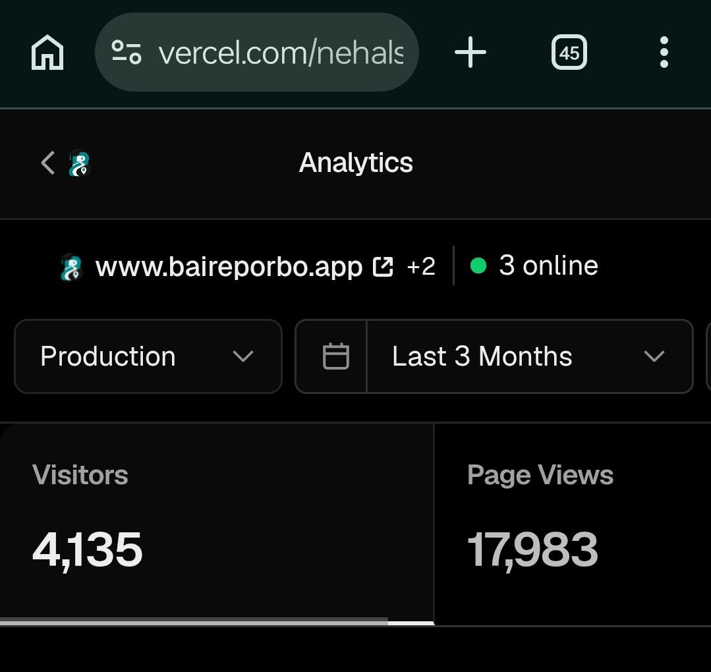
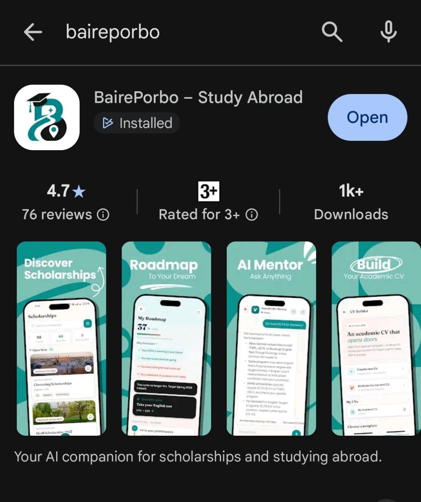
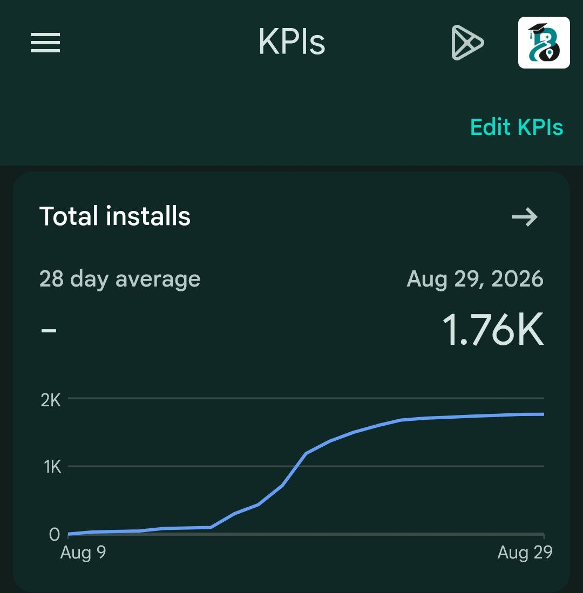

# BairePorbo — AI Scholarship Platform

> **Live at [baireporbo.app](https://baireporbo.app)** · **Android on [Google Play](https://play.google.com/store/apps/details?id=app.baireporbo.android)** — An AI-powered scholarship discovery and guidance platform built for Bangladeshi students pursuing international higher education.

BairePorbo (Bengali: *"let's go abroad"*) helps students find, understand, and apply for scholarships through a curated database, AI-driven matching, and a conversational AI mentor — on the web and in a native Android app. The experience is bilingual (Bengali + English).

[](https://play.google.com/store/apps/details?id=app.baireporbo.android)

---

## Live Traffic

The platform is in active production with real users on both web and Android. Traffic is organic — driven primarily through Facebook community groups and word-of-mouth among Bangladeshi students.

### Web — last 3 months



| Metric | Last 3 Months |
|---|---|
| Unique Visitors | **4,135** |
| Page Views | **17,983** |

### Android — Google Play

[BairePorbo – Study Abroad](https://play.google.com/store/apps/details?id=app.baireporbo.android) is live on the Play Store (`app.baireporbo.android`).





| Metric | Value |
|---|---|
| Total installs | **1.76K** |
| Play Store rating | **4.7 ★** (76 reviews) |
| Listed downloads | **1K+** |

---

## What It Does

- **AI Mentor Chat** — Students ask scholarship-related questions and get context-aware answers grounded in the actual scholarship catalogue via RAG (Retrieval-Augmented Generation). Anonymous users get a 3-message trial; signed-in users get a higher limit.
- **Scholarship Discovery** — A filterable, searchable catalogue of international scholarships with AI-generated summaries, eligibility breakdowns, and deadline tracking.
- **Semantic Matching** — OpenRouter embeddings (`nvidia/nemotron-3-embed-1b:free`, stored as 1024-dim, HNSW index) power vector similarity search between student profiles and scholarship content.
- **Study-abroad Roadmap** — A personalised progress tracker (milestones, readiness score, English-test steps) so students can see what to do next.
- **Academic CV Builder** — Create a CV from templates, or upload an existing one for AI analysis.
- **Student Dashboard** — Personalised scholarship matches, bookmarks, and an application task tracker.
- **Admin Scholarship Wizard** — Paste → Parse (AI) → Enrich (AI) → Thumbnail Upload → Publish → RAG Ingest. Admins can go from a raw scholarship URL to a fully published, AI-searchable listing in minutes.
- **Educational Guides** — CMS-managed long-form guides (IELTS prep, GRE waivers, visa tips) with slugs, FAQs, and cover images.
- **Bilingual UI** — `LangProvider` for live Bengali/English toggle across web and Android.
- **Android app** — Native Expo / React Native client on [Google Play](https://play.google.com/store/apps/details?id=app.baireporbo.android), talking to the same production API. The website remains installable as a PWA.

---

## Tech Stack

| Layer | Technology |
|---|---|
| **Web** | [Next.js 16](https://nextjs.org) (App Router), React 19 |
| **Mobile** | [Expo](https://expo.dev) SDK 57, React Native, Expo Router |
| **Language** | TypeScript 5 |
| **Auth** | [Clerk](https://clerk.com) — email/password + Google OAuth (web + native), webhook-seeded profiles |
| **Database** | [Neon](https://neon.tech) Serverless PostgreSQL 18 + **pgvector** |
| **Storage** | Cloudflare R2 (S3-compatible) — thumbnails, guide covers |
| **Chat LLM** | [OpenRouter](https://openrouter.ai) — `deepseek/deepseek-v4-flash` with `google/gemini-3.7-flash` fallback |
| **Embeddings / Admin AI** | [OpenRouter](https://openrouter.ai) — `nvidia/nemotron-3-embed-1b:free` embeddings; NVIDIA NIM still optional for admin completions |
| **Rate Limiting** | Redis via `ioredis` (in-memory `Map` fallback) |
| **Push** | Firebase Cloud Messaging (Android) + GitHub Actions daily digest cron |
| **Analytics** | Cloudflare Web Analytics |
| **Styling (web)** | Vanilla CSS Modules — no UI framework |
| **Styling (mobile)** | NativeWind |
| **Fonts** | Fraunces, Manrope, Hind Siliguri |
| **Package Manager** | pnpm |
| **Hosting** | [Railway](https://railway.app) (Singapore) — deploys from `main` |
| **CDN** | `cdn.baireporbo.app` (Cloudflare R2 public bucket) |

---

## Architecture Highlights

### AI Pipeline

```
User message
    │
    ▼
Rate limit check (Redis / in-memory)
    │
    ▼
Embed query → OpenRouter (1024-dim)
    │
    ▼
Vector similarity search → Neon pgvector (HNSW, cosine)
    │
    ▼
Matched scholarships re-read from Postgres → verified-facts block
    │
    ▼
System prompt = grounding rules + today's date + student profile + facts
    │
    ▼
OpenRouter streaming chat (DeepSeek → Gemini Flash fallback)
    │
    ▼
Streamed response to client (web or Android)
```

### Rate Limiting Tiers

| User Type | Per Hour | Per Day |
|---|---|---|
| Anonymous | 3 | 3 |
| Signed-in student | 6 | 15 |
| Admin | 50 | 200 |
| Global circuit breaker | — | 20,000 |

### Admin Scholarship Workflow

1. **Paste & Parse** — Paste raw text/URL; AI extracts structured fields
2. **Enrich** — AI fills in missing details, generates summary and tips
3. **Thumbnail** — Upload to R2 with WebP conversion
4. **Publish** — Set status to `active`, toggle `is_live`
5. **RAG Ingest** — Scholarship chunked, embedded, and stored in `ScholarshipDoc` for vector search

### Database Schema (Neon)

| Table | Purpose |
|---|---|
| `profiles` | User profile, role (`student`/`admin`), Clerk user ID as PK |
| `scholarships` | Full scholarship catalogue with AI-enriched fields and status workflow |
| `ScholarshipDoc` | RAG chunks with `VECTOR(1024)` column, HNSW index |
| `chat_sessions` / `chat_messages` | AI chat history (authenticated and anonymous) |
| `user_bookmarks` | Saved scholarships per user |
| `user_tasks` | Application to-do tracker |
| `roadmaps` / `milestone_progress` | Personalised study-abroad roadmap + milestone progress |
| `user_cvs` / `cv_analyses` | Academic CV documents and AI analysis results |
| `guides` | Educational guide content with slugs and FAQs |
| `push_tokens` | FCM device tokens for Android notifications |
---

## Project Structure

```
BairePorbo/
├── apps/
│   ├── web/                   # Next.js 16 — production website + API
│   │   ├── src/
│   │   │   ├── app/           # App Router pages and API routes
│   │   │   │   ├── api/       # REST API (chat, scholarships, roadmap, cv, admin, webhooks, ...)
│   │   │   │   ├── admin/     # Admin dashboard pages
│   │   │   │   ├── dashboard/ # Student dashboard
│   │   │   │   ├── chat/      # AI mentor
│   │   │   │   ├── cv-builder/# Academic CV builder + analyser
│   │   │   │   └── ...        # Landing, scholarships, guides, auth, legal
│   │   │   ├── lib/           # OpenRouter client, auth helpers, rate limiter
│   │   │   ├── utils/         # DB (Neon), R2 storage, API auth guards
│   │   │   └── components/    # Shared UI components
│   │   ├── supabase/
│   │   │   └── migrations/    # SQL migration history, now applied to Neon
│   │   └── scripts/           # One-off utility scripts
│   └── mobile/                # Expo SDK 57 — Android app on Google Play
│       └── app/               # Expo Router screens (home, scholarships, chat, roadmap, CV, guides)
├── packages/
│   └── shared/                # Shared TypeScript types + typed API client
├── .github/workflows/         # Daily push-digest cron (GitHub Actions → Railway)
├── scripts/                   # Data migration scripts (Supabase → Clerk/Neon, June 2026)
├── ARCHITECTURE.md            # Deep technical architecture reference
├── MIGRATION.md               # Infrastructure migration log (June 2026)
└── .env.example               # Canonical environment variable template
```

---

## API Routes

| Group | Endpoints |
|---|---|
| **Chat** | `POST /api/chat`, `GET/POST /api/chat/sessions`, messages |
| **Profile** | `GET/PATCH /api/profile`, scholarship match scoring |
| **Scholarships** | `GET /api/scholarships`, `GET /api/scholarships/[id]` |
| **Bookmarks & Tasks** | `GET/POST/DELETE /api/bookmarks`, `GET/POST/PATCH/DELETE /api/tasks` |
| **Roadmap** | `GET /api/roadmap`, `PATCH /api/roadmap/milestones/[key]` |
| **CV** | `GET/POST /api/cv`, `GET/PATCH/DELETE /api/cv/[id]`, `POST /api/cv/analyze` |
| **Dashboard** | `GET /api/dashboard` — aggregated student data |
| **Admin Scholarships** | CRUD, parse, enrich, ingest, thumbnail, generate-slugs, ingest-all |
| **Admin Guides** | CRUD, cover upload, AI refine |
| **Push** | `POST /api/push/register`, `GET /api/cron/push-digest`, admin broadcast |
| **Webhooks** | `POST /api/webhooks/clerk` — Svix-verified user creation |

The Android app calls the same production API at `https://www.baireporbo.app`.

---

## Application Routes

| Route | Description | Access |
|---|---|---|
| `/` | Landing page (Android visitors are sent to Play Store) | Public |
| `/scholarships` | Scholarship catalogue with filters | Public |
| `/scholarships/[slug]` | Scholarship detail (SEO slugs) | Public |
| `/guide` / `/guide/[slug]` | Educational guides | Public |
| `/chat` | AI Mentor (3-message anonymous trial) | Public / Students |
| `/cv-builder` | Academic CV builder + analyser | Students |
| `/dashboard` | Personalised dashboard | Students |
| `/profile` | Profile & matching settings | Students |
| `/admin/*` | Scholarship + guide management | Admins |
| `/auth/login` `/auth/signup` | Clerk auth pages | Public |

---

## Authentication

Powered by **Clerk** (migrated from Supabase Auth in June 2026):

- Email/password and Google OAuth on web and Android
- Svix-verified webhook seeds `profiles` row and 3 default `user_tasks` on `user.created`
- Roles stored in Neon `profiles.role` (`student` / `admin`)
- `clerkMiddleware` in `src/proxy.ts` protects all non-static routes
- Client-side `auth-guard.tsx` / `admin-guard.tsx` enforce role-based access
- Server-side `requireAdmin()` in `src/utils/api-auth.ts` guards all admin API routes
- Mobile uses `@clerk/clerk-expo` with a Bearer session token against the same Clerk instance

---

## Getting Started (Local Development)

### Prerequisites

- Node.js 22
- pnpm ≥ 9 (`npm install -g pnpm`)
- [Clerk](https://clerk.com) project (free tier works; enable Native API for the Android app)
- [Neon](https://neon.tech) database with pgvector enabled
- [NVIDIA NIM](https://build.nvidia.com) API key *(optional; admin parse/enrich only)*
- [OpenRouter](https://openrouter.ai) API key
- [Cloudflare R2](https://developers.cloudflare.com/r2/) bucket *(optional for local dev)*
- Redis instance *(optional — app falls back to in-memory)*

### 1. Clone & Install

```bash
git clone https://github.com/mushfiq-nehal/BairePorbo.git
cd BairePorbo/apps/web
pnpm install
```

### 2. Configure Environment

```bash
cp ../../.env.example .env.local
```

Fill in `.env.local`:

| Variable | Description |
|---|---|
| `DATABASE_URL` | Neon connection string |
| `NEXT_PUBLIC_CLERK_PUBLISHABLE_KEY` | Clerk publishable key |
| `CLERK_SECRET_KEY` | Clerk secret key |
| `CLERK_WEBHOOK_SECRET` | Clerk webhook signing secret (Svix) |
| `OPENROUTER_API_KEY` | OpenRouter API key (chat + embeddings) |
| `OPENROUTER_MODEL` | Primary chat model (e.g. `deepseek/deepseek-v4-flash`) |
| `OPENROUTER_EMBEDDING_MODEL` | Embedding model (`nvidia/nemotron-3-embed-1b:free`) |
| `NVIDIA_API_KEY` | NVIDIA NIM API key *(optional; admin parse/enrich NIM models only)* |
| `R2_ACCOUNT_ID` / `R2_ACCESS_KEY_ID` / `R2_SECRET_ACCESS_KEY` | Cloudflare R2 credentials |
| `R2_BUCKET_NAME` | R2 bucket name |
| `NEXT_PUBLIC_R2_PUBLIC_DOMAIN` | Public CDN domain for assets |
| `REDIS_URL` | Redis URL *(leave empty to use in-memory fallback)* |
| `CRON_SECRET` | Shared secret for `/api/cron/push-digest` |

### 3. Apply Database Migrations

Run the SQL migrations in order from `apps/web/supabase/migrations/` against your Neon database. Start with `018_neon_migration.sql` for the full current schema, then apply later numbered files (CV, push, roadmap, …).

### 4. Run the Dev Server

```bash
pnpm dev
```

App available at [http://localhost:3000](http://localhost:3000).

### Android (optional)

```bash
cd apps/mobile
pnpm install
pnpm start
```

Point `EXPO_PUBLIC_API_BASE` / `app.json extra.apiBase` at `https://www.baireporbo.app` (or your local web server). Use the `www` host in production — the apex domain 301-redirects and would break POSTs.

---

## Scripts

```bash
# from apps/web/
pnpm dev       # Start development server (Next.js)
pnpm build     # Production build
pnpm start     # Start production server
pnpm lint      # Run ESLint
```

---

## Infrastructure

### June 2026 — off Supabase

The platform was originally built on Supabase. In June 2026 it was fully migrated to a more scalable, independent stack:

| Before | After |
|---|---|
| Supabase Auth | Clerk |
| Supabase PostgreSQL | Neon Serverless PostgreSQL |
| Supabase Storage | Cloudflare R2 |
| NVIDIA NIM chat | OpenRouter (DeepSeek + Gemini Flash) |

132 users, 54 scholarships, 152 embedding documents, and 82 chat sessions were migrated with zero downtime. See [`MIGRATION.md`](MIGRATION.md) for the full log.

### September 2026 — Vercel → Railway

The Next.js app moved off Vercel onto a Railway web service so long-running work (SSE chat, CV analysis, RAG ingest) is no longer capped by serverless CPU and duration limits.

| Before | After |
|---|---|
| Vercel (serverless) | Railway container in Singapore (`www.baireporbo.app`) |
| Vercel Cron | GitHub Actions daily job → `/api/cron/push-digest` |
| Vercel Analytics | Cloudflare Web Analytics |

Railway builds `apps/web` from `main` (Railpack) and runs `next start`. The Android app is unchanged: it still talks to the same production API.

---

## Status

- **Production:** [baireporbo.app](https://baireporbo.app) — live on Railway
- **Android:** [BairePorbo – Study Abroad](https://play.google.com/store/apps/details?id=app.baireporbo.android) on Google Play (`app.baireporbo.android`)
- **CI/CD:** Railway deploys on every push to `main`; daily push digest via GitHub Actions

---

## License

All rights reserved © 2026 BairePorbo. This is a proprietary product — the source is shared for reference and evaluation purposes only.
