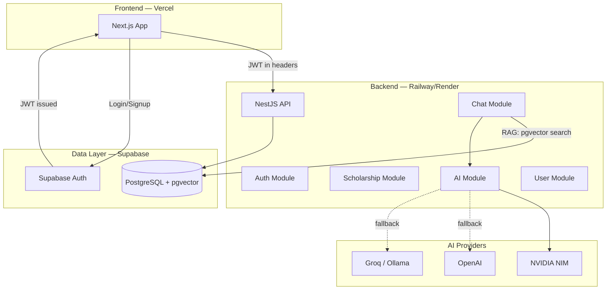
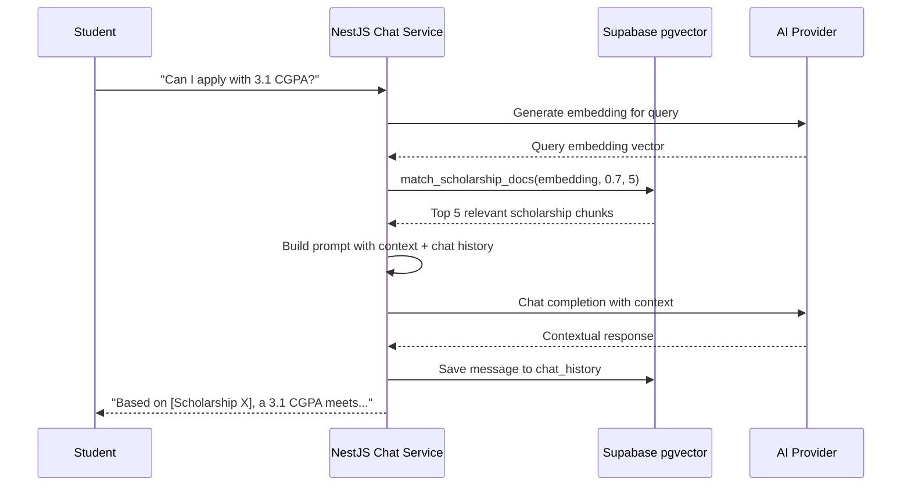

# BairePorbo.app — Implementation Plan

AI-powered scholarship & higher study guidance platform for Bangladeshi/South Asian students.

---

## Architecture Overview



---

## User Review Required

> [!IMPORTANT]
> **Monorepo vs Polyrepo** — This plan uses a **Turborepo monorepo** with `apps/web` (Next.js) and `apps/api` (NestJS) sharing a `packages/db` Prisma layer. This enables shared types and a single repo for your portfolio. If you prefer two separate repos, let me know.

> [!IMPORTANT]
> **Auth Choice: Supabase Auth** — Research strongly favors Supabase Auth over NextAuth when using a separate NestJS backend. Supabase issues JWTs that NestJS validates via `passport-jwt`, giving clean separation. NextAuth is tightly coupled to Next.js and creates "shared secret" headaches with a separate API. Confirm you're okay with this.

> [!WARNING]
> **NVIDIA NIM API Key** — You'll need a free NVIDIA developer account at [build.nvidia.com](https://build.nvidia.com). The free tier allows ~40 req/min which is fine for MVP. The provider abstraction lets you swap to OpenAI/Groq/Ollama anytime.

---

## Open Questions

1. **Domain & Branding** — Do you already have the `baireporbo.app` domain? Any logo/color palette preferences, or should I design from scratch?
2. **Scholarship Data Source** — Will you seed scholarships manually via the admin panel, or do you have a dataset/CSV to bulk-import initially?
3. **Deployment Budget** — Railway free tier has limits. Are you okay with Render free tier as the backend host, or do you have a budget for Railway Pro?

---

## Proposed Changes

### Monorepo Scaffold

#### [NEW] Root config files

```
BairePorbo/
├── apps/
│   ├── web/                 # Next.js 15 frontend
│   └── api/                 # NestJS backend
├── packages/
│   ├── db/                  # Prisma schema + client
│   ├── shared/              # Shared types, Zod schemas, constants
│   └── tsconfig/            # Shared TypeScript configs
├── turbo.json
├── pnpm-workspace.yaml
├── package.json
├── .env.example
└── .gitignore
```

**Why Turborepo**: Build caching, parallel tasks, shared types between frontend/backend — ideal for a portfolio project that demonstrates engineering maturity.

---

### Database Layer (`packages/db`)

#### [NEW] [schema.prisma](file:///home/nehal/Dev/BairePorbo/packages/db/prisma/schema.prisma)

Core tables with Prisma schema:

```prisma
model User {
  id            String       @id @default(uuid())
  email         String       @unique
  name          String?
  role          Role         @default(USER)
  avatarUrl     String?
  supabaseId    String       @unique  // links to Supabase Auth
  bookmarks     Bookmark[]
  chatSessions  ChatSession[]
  createdAt     DateTime     @default(now())
  updatedAt     DateTime     @updatedAt
}

enum Role { GUEST USER ADMIN }

model Scholarship {
  id            String       @id @default(uuid())
  title         String
  country       String
  degreeLevel   DegreeLevel
  deadline      DateTime?
  fundingType   FundingType
  eligibility   String       // raw text
  officialUrl   String
  description   String?
  tags          String[]     // PostgreSQL array
  universityId  String?
  university    University?  @relation(fields: [universityId], references: [id])
  aiSummary     AISummary?
  bookmarks     Bookmark[]
  createdAt     DateTime     @default(now())
  updatedAt     DateTime     @updatedAt
}

enum DegreeLevel { BACHELORS MASTERS PHD POSTDOC }
enum FundingType { FULL PARTIAL TUITION_ONLY STIPEND OTHER }

model AISummary {
  id                  String      @id @default(uuid())
  scholarshipId       String      @unique
  scholarship         Scholarship @relation(fields: [scholarshipId], references: [id])
  simplifiedExplanation String
  eligibilitySummary  String
  competitiveness     String
  preparationStrategy String
  applicationTips     String
  generatedBy         String      // provider name: "nvidia-nim", "openai", etc.
  generatedAt         DateTime    @default(now())
}

model Bookmark {
  id            String      @id @default(uuid())
  userId        String
  user          User        @relation(fields: [userId], references: [id])
  scholarshipId String
  scholarship   Scholarship @relation(fields: [scholarshipId], references: [id])
  createdAt     DateTime    @default(now())
  @@unique([userId, scholarshipId])
}

model ChatSession {
  id        String        @id @default(uuid())
  userId    String
  user      User          @relation(fields: [userId], references: [id])
  title     String?
  messages  ChatMessage[]
  createdAt DateTime      @default(now())
}

model ChatMessage {
  id        String      @id @default(uuid())
  sessionId String
  session   ChatSession @relation(fields: [sessionId], references: [id])
  role      MessageRole
  content   String
  createdAt DateTime    @default(now())
}

enum MessageRole { USER ASSISTANT SYSTEM }

model Country {
  id   String @id @default(uuid())
  name String @unique
  code String @unique  // ISO 3166-1 alpha-2
}

model University {
  id           String        @id @default(uuid())
  name         String
  country      String
  scholarships Scholarship[]
}

model ScholarshipDoc {
  id        String   @id @default(uuid())
  content   String
  metadata  Json?
  embedding Unsupported("vector(1536)")
  scholarshipId String?
}
```

**Key decisions**:
- `ScholarshipDoc` table with `pgvector` for RAG semantic search
- `AISummary` is 1:1 with `Scholarship` — cached, not generated per request
- `supabaseId` on User links to Supabase Auth identity

#### [NEW] Supabase SQL migration for pgvector

```sql
CREATE EXTENSION IF NOT EXISTS vector;
-- HNSW index for fast similarity search
CREATE INDEX ON "ScholarshipDoc" USING hnsw (embedding vector_cosine_ops);
-- RPC function for semantic search
CREATE OR REPLACE FUNCTION match_scholarship_docs(
  query_embedding vector(1536),
  match_threshold float DEFAULT 0.7,
  match_count int DEFAULT 5
) RETURNS TABLE (id uuid, content text, metadata jsonb, similarity float)
LANGUAGE plpgsql AS $$
BEGIN
  RETURN QUERY
  SELECT d.id, d.content, d.metadata,
         1 - (d.embedding <=> query_embedding) as similarity
  FROM "ScholarshipDoc" d
  WHERE 1 - (d.embedding <=> query_embedding) > match_threshold
  ORDER BY d.embedding <=> query_embedding
  LIMIT match_count;
END;
$$;
```

---

### NestJS Backend (`apps/api`)

#### [NEW] Project structure

```
apps/api/src/
├── main.ts
├── app.module.ts
├── common/
│   ├── guards/           # JwtAuthGuard, RolesGuard
│   ├── decorators/       # @CurrentUser, @Roles
│   ├── interceptors/     # ResponseTransform, Logging
│   ├── filters/          # GlobalExceptionFilter
│   └── pipes/            # ZodValidationPipe
├── config/
│   └── config.module.ts  # env validation with Zod
├── modules/
│   ├── auth/
│   │   ├── auth.module.ts
│   │   ├── auth.controller.ts
│   │   ├── auth.service.ts
│   │   ├── strategies/
│   │   │   └── supabase.strategy.ts   # passport-jwt verifying Supabase JWTs
│   │   └── dto/
│   ├── scholarships/
│   │   ├── scholarships.module.ts
│   │   ├── scholarships.controller.ts
│   │   ├── scholarships.service.ts
│   │   └── dto/
│   ├── ai/
│   │   ├── ai.module.ts
│   │   ├── ai.service.ts             # orchestrator
│   │   ├── ai.controller.ts          # admin trigger endpoints
│   │   └── providers/
│   │       ├── ai-provider.interface.ts
│   │       ├── nvidia-nim.provider.ts
│   │       ├── openai.provider.ts
│   │       └── ollama.provider.ts
│   ├── chat/
│   │   ├── chat.module.ts
│   │   ├── chat.controller.ts
│   │   ├── chat.service.ts           # RAG pipeline
│   │   ├── chat.gateway.ts           # WebSocket for streaming
│   │   └── dto/
│   ├── users/
│   │   ├── users.module.ts
│   │   ├── users.controller.ts
│   │   ├── users.service.ts
│   │   └── dto/
│   └── bookmarks/
│       ├── bookmarks.module.ts
│       ├── bookmarks.controller.ts
│       ├── bookmarks.service.ts
│       └── dto/
└── prisma/
    └── prisma.service.ts             # shared Prisma client
```

#### AI Provider Abstraction (Critical Architecture)

```typescript
// ai-provider.interface.ts
export interface AIProvider {
  readonly name: string;

  generateSummary(scholarshipData: ScholarshipInput): Promise<AISummaryOutput>;
  generateRoadmap(userProfile: UserProfile): Promise<RoadmapOutput>;
  chat(messages: ChatMessage[], context?: string): Promise<string>;
  generateEmbedding(text: string): Promise<number[]>;
}
```

```typescript
// ai.service.ts — orchestrator with fallback chain
@Injectable()
export class AIService {
  private providers: AIProvider[];

  constructor(
    private nvidia: NvidiaNimProvider,
    private openai: OpenAIProvider,
    private ollama: OllamaProvider,
    private config: ConfigService,
  ) {
    // Priority order from config
    this.providers = [this.nvidia, this.openai, this.ollama];
  }

  async generateSummary(data: ScholarshipInput): Promise<AISummaryOutput> {
    for (const provider of this.providers) {
      try {
        return await provider.generateSummary(data);
      } catch (error) {
        this.logger.warn(`${provider.name} failed, trying next...`);
      }
    }
    throw new ServiceUnavailableException('All AI providers failed');
  }
}
```

```typescript
// nvidia-nim.provider.ts — uses OpenAI-compatible SDK
@Injectable()
export class NvidiaNimProvider implements AIProvider {
  readonly name = 'nvidia-nim';
  private client: OpenAI;

  constructor(private config: ConfigService) {
    this.client = new OpenAI({
      apiKey: this.config.get('NIM_API_KEY'),
      baseURL: 'https://integrate.api.nvidia.com/v1',
    });
  }

  async chat(messages, context?) {
    const response = await this.client.chat.completions.create({
      model: 'meta/llama-3.1-70b-instruct',
      messages: [
        { role: 'system', content: SYSTEM_PROMPT + (context || '') },
        ...messages,
      ],
    });
    return response.choices[0].message.content;
  }
}
```

#### RAG Chat Pipeline



#### API Routes

| Method | Route | Auth | Description |
|--------|-------|------|-------------|
| `GET` | `/scholarships` | Public | List with filters, pagination, search |
| `GET` | `/scholarships/:id` | Public | Detail + AI summary |
| `GET` | `/scholarships/search` | Public | Full-text + tag search |
| `POST` | `/auth/callback` | Public | Sync Supabase user to local DB |
| `POST` | `/bookmarks` | User | Toggle bookmark |
| `GET` | `/bookmarks` | User | List user bookmarks |
| `POST` | `/chat/sessions` | User | Create chat session |
| `POST` | `/chat/sessions/:id/messages` | User | Send message (RAG pipeline) |
| `GET` | `/chat/sessions` | User | List user's chat sessions |
| `GET` | `/dashboard` | User | User stats + bookmarks + recent chats |
| `POST` | `/admin/scholarships` | Admin | Create scholarship |
| `PUT` | `/admin/scholarships/:id` | Admin | Update scholarship |
| `DELETE` | `/admin/scholarships/:id` | Admin | Delete scholarship |
| `POST` | `/admin/ai/regenerate/:id` | Admin | Regenerate AI summary |
| `GET` | `/admin/analytics` | Admin | Platform stats |

---

### Next.js Frontend (`apps/web`)

#### [NEW] Project structure

```
apps/web/
├── src/
│   ├── app/
│   │   ├── layout.tsx                 # Root layout, fonts, providers
│   │   ├── page.tsx                   # Landing/Hero page
│   │   ├── scholarships/
│   │   │   ├── page.tsx               # Browse + filter + search
│   │   │   └── [id]/page.tsx          # Scholarship detail + AI summary
│   │   ├── chat/
│   │   │   └── page.tsx               # AI Mentor chat interface
│   │   ├── dashboard/
│   │   │   └── page.tsx               # User dashboard
│   │   ├── admin/
│   │   │   ├── page.tsx               # Admin overview
│   │   │   ├── scholarships/page.tsx  # CRUD table
│   │   │   └── analytics/page.tsx     # Analytics
│   │   ├── auth/
│   │   │   ├── login/page.tsx
│   │   │   └── callback/page.tsx      # Supabase auth callback
│   │   └── api/                       # Minimal — only auth helpers
│   ├── components/
│   │   ├── ui/                        # Reusable: Button, Card, Modal, Badge, etc.
│   │   ├── layout/                    # Navbar, Footer, Sidebar
│   │   ├── scholarship/              # ScholarshipCard, FilterBar, SearchBar
│   │   ├── chat/                      # ChatWindow, MessageBubble, ChatInput
│   │   └── dashboard/                # BookmarkList, Tracker, Stats
│   ├── lib/
│   │   ├── api.ts                     # Axios/fetch wrapper for NestJS API
│   │   ├── supabase.ts               # Supabase client (auth only)
│   │   └── utils.ts
│   ├── hooks/                         # useAuth, useScholarships, useChat
│   └── styles/
│       └── globals.css
├── public/
└── package.json
```

#### Design System

- **Typography**: Inter (headings) + DM Sans (body) from Google Fonts
- **Color Palette**: Deep navy (#0A1628) + electric blue (#3B82F6) + teal accent (#14B8A6) + warm amber (#F59E0B) for CTAs
- **Dark mode first** with light mode toggle
- **Glassmorphism** cards with `backdrop-filter: blur`
- **Micro-animations**: Framer Motion for page transitions, card hovers, chat message reveals
- **Responsive**: Mobile-first, breakpoints at 640/768/1024/1280px

#### Key Pages

| Page | Key Features |
|------|-------------|
| **Landing** | Hero with animated gradient, value props, CTA, featured scholarships |
| **Browse** | Filter sidebar (country, degree, funding, deadline), search bar, paginated cards |
| **Detail** | Scholarship info + tabbed AI summary (explanation, eligibility, tips, strategy) |
| **Chat** | Full-screen chat UI, session sidebar, streaming responses, suggested prompts |
| **Dashboard** | Bookmarked scholarships, recent chats, application tracker (future) |
| **Admin** | Data table with CRUD, AI regeneration triggers, simple analytics charts |

---

### Shared Package (`packages/shared`)

#### [NEW] Shared Zod schemas + types

```typescript
// Shared validation schemas used by both frontend forms and backend DTOs
export const createScholarshipSchema = z.object({
  title: z.string().min(3).max(200),
  country: z.string().min(2),
  degreeLevel: z.enum(['BACHELORS', 'MASTERS', 'PHD', 'POSTDOC']),
  deadline: z.string().datetime().optional(),
  fundingType: z.enum(['FULL', 'PARTIAL', 'TUITION_ONLY', 'STIPEND', 'OTHER']),
  eligibility: z.string().min(10),
  officialUrl: z.string().url(),
  tags: z.array(z.string()).default([]),
});

export type CreateScholarshipInput = z.infer<typeof createScholarshipSchema>;
```

---

## Development Phases

### Phase 1 — Foundation (Week 1-2)
- Monorepo scaffold (Turborepo + pnpm)
- NestJS project with config, Prisma, global guards/filters
- Supabase project setup (PostgreSQL + Auth + pgvector)
- Prisma schema + migrations
- Auth module (Supabase JWT verification in NestJS)
- Next.js project with Supabase Auth login/signup
- Basic layout (Navbar, Footer, dark mode)

### Phase 2 — Scholarship Core (Week 3-4)
- Scholarship CRUD (admin endpoints + admin UI)
- Browse page with filters, search, pagination
- Scholarship detail page
- Bookmark system (API + UI)
- Seed database with 20-30 real scholarships

### Phase 3 — AI Integration (Week 5-6)
- AI provider abstraction layer
- NVIDIA NIM provider implementation
- OpenAI fallback provider
- AI summary generation for scholarships
- Admin trigger for AI regeneration
- AI summary display on scholarship detail page

### Phase 4 — AI Mentor Chat (Week 7-8)
- pgvector setup + scholarship document ingestion
- Embedding generation pipeline
- RAG retrieval service
- Chat session management (API + DB)
- Chat UI with streaming responses (WebSocket)
- Chat history persistence

### Phase 5 — Polish & Deploy (Week 9-10)
- Landing page with animations
- User dashboard
- Admin analytics
- Rate limiting + input validation
- Error handling + loading states
- SEO optimization (meta tags, OG images)
- Deploy: Vercel (web) + Railway (api) + Supabase (db)
- README + documentation

---

## Verification Plan

### Automated Tests
- **Backend**: Jest unit tests for services, e2e tests for API routes (`@nestjs/testing`)
- **Commands**: `pnpm --filter api test` and `pnpm --filter api test:e2e`
- **Frontend**: Playwright for critical flows (login → browse → bookmark → chat)

### Manual Verification
- Browser test each page at desktop + mobile breakpoints
- Test AI provider fallback by disabling NIM API key
- Test auth flow: signup → login → protected route → logout
- Test admin CRUD: create scholarship → verify in browse → edit → delete
- Verify RAG chat returns contextually relevant answers
- Lighthouse audit for performance + SEO scores

### Build Validation
```bash
pnpm turbo build    # Verify both apps build without errors
pnpm turbo lint     # Ensure no lint issues
pnpm turbo typecheck # Full TypeScript validation
```
