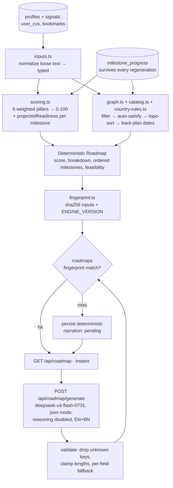

# Implementation Plan — AI Personalized Roadmap (v1)

> **Status:** scoped down from the original 13-task plan to a shippable v1. Everything cut is preserved in
> [Post-launch backlog](#post-launch-backlog) with the trigger that should bring it back.
> The formal, testable acceptance criteria live in `.kiro/specs/roadmap/requirements.md` — this file is the
> technical companion (schema, module layout, prompt shape, sequencing), not the contract.

## Problem Statement

Students browse BairePorbo and leave without knowing what to do. The app has the raw material — profile fields, CV builder, guides, catalogue, mentor — but nothing connecting them. This feature is the spine: a scored, profile-driven journey that says where the student stands, what to do next in order, and the single highest-impact action today.

**Scope:** `apps/mobile` as the surface, new API routes in `apps/web`, engine in `apps/web/src/lib/roadmap/` so a web page can reuse it later.

**Non-goals for v1:** web UI, document file uploads (status only), social comparison, admin editing of the catalog, gamification, analytics tables, cron nudges, offline replay.

## The ten locked decisions

| # | Decision |
|---|---|
| 1 | OpenRouter `deepseek/deepseek-v4-flash-0731` (verified live: 1M ctx, `response_format` + `structured_outputs`). MUST pass `reasoning: { enabled: false }`. Cost is not a constraint |
| 2 | Bottom tabs unchanged. Home's "Scholarships / 30+ countries" quick-action card is **replaced** by a Roadmap card; CV Builder stays. Roadmap is a full-screen route group `app/roadmap/` |
| 3 | Hybrid: a deterministic, versioned TypeScript engine owns the readiness score **and** the milestone set. The AI is a narrator only, constrained to a whitelist of milestone keys |
| 4 | Bilingual EN+BN in a single AI call. UI chrome stays human-written in `translations.ts`; only explanations are AI-generated |
| 5 | Pillar weights ship as specified, tuned later behind an `ENGINE_VERSION` bump |
| 6 | Home's "Your profile — 42%" card is **removed** and folded into the Roadmap card, so exactly one percentage appears on screen. Profile completeness becomes "confidence" inside the score breakdown |
| 7 | **Three tables only:** new columns on `profiles`, plus `roadmaps` and `milestone_progress` |
| 8 | **Zero new native dependencies.** No `react-native-svg`, no `expo-haptics`, no `expo prebuild`. Reanimated 4.5 + `expo-linear-gradient` are already installed and sufficient |
| 9 | **Five countries + a generic fallback** that must be good enough to ship alone |
| 10 | Completion feedback is in scope (visual). Gamification is out |

**Naming note:** decision 7 names the tables `roadmaps` and `milestone_progress` (the earlier draft said `user_roadmaps` / `user_milestone_progress`). The shorter names are what ships; both rows are keyed by the Clerk user id, so the `user_` prefix carried no information.

## The app is live — these are hard constraints

- **Android 0.2.3 / versionCode 5, package `app.baireporbo.android`, Play closed testing, day 9 of 14.** The web app serves real traffic. Neon Postgres is production.
- **Version-skew data loss (the single biggest risk).** `PUT /api/profile` today runs one full `UPDATE ... SET` assigning **every** column from a destructured body with `?? null`. Shipped client 0.2.3 sends exactly 15 keys. Extending the route with the same pattern means every profile save from a not-yet-updated client silently wipes `target_country`, `target_intake_*`, `english_test_*` and `docs`.
  **Fix:** build the `SET` clause from the keys *present* in the request body and execute via `sqlQuery(text, params)` — which `utils/db.ts` explicitly recommends for variable SET clauses. Semantics: key absent → column untouched; key present with `null` or `""` → cleared. Both current clients depend on the second rule (mobile sends `field || null`; web posts back the whole row), so clearing must keep working.
  **Two regression tests are mandatory:** (a) a 0.2.3-shaped 15-key payload leaves the new columns intact; (b) explicit `{ cgpa: null }` still clears.
- **Do not add the new columns to `PROFILE_FIELDS` in `api/dashboard/route.ts`.** That array drives `readiness = filled/14`. Adding 7 columns would silently regress every live web user (8/14 → 8/21). Leave it exactly as is.
- **Do not change `/api/profile/match`'s field list** — it would alter embedding-based match results for live users. Structurally this one is already safe: the route runs `SELECT * FROM profiles` but its `buildQuery` reads an explicit enumerated list of 14 named fields and never iterates the row's keys, so Migration_026's new columns cannot enter the embedding text. (The sparseness guard above it checks `target_degree`, `preferred_countries`, `cgpa`.) Note the verb too: the route exports `GET` only, and `apps/web/src/app/dashboard/page.tsx` calls it with a bare `fetch()`.
- **Migration `026_ai_roadmap.sql`** (highest existing is `025_push_notifications.sql`). Additive only: nullable `ADD COLUMN IF NOT EXISTS` with no default and no `NOT NULL`, plus `CREATE TABLE IF NOT EXISTS`. No DROP / RENAME / ALTER TYPE / new constraints on existing data — metadata-only on PG 18, no table rewrite. Wrap the file in a transaction with `SET LOCAL lock_timeout = '3s'` and `SET LOCAL statement_timeout = '30s'` so it fails fast instead of stalling app queries behind an ACCESS EXCLUSIVE lock.
- **Verify on a Neon branch first.** Branch from production (copy-on-write, no primary load), point a local `DATABASE_URL` at it, apply the migration, run engine + route tests + real AI calls, exercise the version-skew case, then apply to production.
- **Deploy order:** migration to the production DB **first**, then code. Never reversed.
- **Rollback:** revert the deploy and **leave the schema in place** (inert nullable columns, empty tables). Never `DROP COLUMN` under pressure.

## Background — verified in the codebase

- **DB:** Neon Postgres via the `sql` tagged template / `sqlQuery(text, params)` (`utils/db.ts`). No ORM, no RLS — every route scopes by `auth.userId`. Migrations are plain SQL in `apps/web/supabase/migrations/`.
- **Auth:** `getUser()` / `requireAdmin()` in `utils/api-auth.ts`. Mobile sends the Clerk token as Bearer through the shared client — no backend auth changes.
- `profiles` is the only student table and every relevant field is loose text: `ielts_score TEXT`, `published_papers TEXT`, `preferred_countries TEXT`, `target_degree` lowercased text, `cgpa` numeric. `user_tasks` no longer exists in the Neon schema — the roadmap owns its own tables.
- Today's "readiness" in `/api/dashboard` is `filledProfileFields / 14 × 100` — form completion, not scholarship readiness. Home renders it as "Your profile 42%". Decision 6 resolves the collision.
- **Cache-AI-JSON pattern to copy:** `api/scholarships/[id]/documents/route.ts` — check column → `{cached:true}` → rate-limit → `fetchCompletion` → sanitize → `UPDATE … ::jsonb`; on AI failure returns 200 with `null` so the client keeps rendering.
- `fetchCompletion` (`lib/ai-completion.ts`) takes `{ model, system, user, maxTokens, temperature, timeoutMs, reasoning, json }`; `json: true` → `response_format: json_object`. Models resolve through `lib/model-options.ts` (`ModelChoice` + `resolveOpenRouterModel`). `lib/cv-analyze.ts` is the reference model-ladder + normalizer. `extractJsonObject` is the lenient parser.
- **Dhaka day math:** `api/cron/push-digest/route.ts` defines `DHAKA_OFFSET_MS = 6 * 60 * 60 * 1000` and floors to local midnight. Reuse that approach for every roadmap date computation.
- **Mobile:** Expo SDK 57, Expo Router, NativeWind v4, TanStack Query, `@baireporbo/shared`, `Txt`/`Card`/`Button`/`Chip`/`Screen`, tokens in `src/theme.ts`, i18n via `useT()` + keyed `translations.ts`. Reanimated 4.5 and `expo-linear-gradient` are installed; `react-native-svg` and `expo-haptics` are **not**, and both are native modules — which is why decision 8 designs around them.
- **No test runner** in either app. The engine is the correctness core, so this plan adds Vitest to `apps/web`.
- **Model gotcha:** `deepseek-v4-flash-0731` has `reasoning.default_enabled: true`, `default_effort: "high"`, and supports only `max`/`high`/`low`. The call must pass `reasoning: { enabled: false }` or every generation burns 15–35 s of invisible thinking tokens — the exact failure already documented in `cv-analyze.ts`.
- **Stale doc:** `mobile_progress.md` claims the app is signed with a debug keystore. Play has accepted an AAB, so a real upload key is configured — that line is out of date and should be corrected when the file is next touched.

## Proposed Solution

### The core bet

The AI never decides the score or the milestone set. A versioned TypeScript engine does, deterministically. The AI is a narrator constrained to a whitelist of milestone keys.

Readiness is a number students will screenshot and compare. If an LLM produces it, the same profile scores 42 today and 51 tomorrow and you can't explain either. With the engine owning it, 42 → 58 is computed by re-running the score with the milestone marked complete — the mentor's promise is arithmetic. It's also unit-testable, works when OpenRouter is down, and renders instantly.



### Data model — migration `026_ai_roadmap.sql`

**1. Extend `profiles`** (additive, all nullable — no existing route breaks):

```sql
target_country TEXT, target_intake_term TEXT, target_intake_year INT,
english_test_type TEXT, english_test_status TEXT, english_test_date DATE,
docs JSONB, roadmap_onboarded_at TIMESTAMPTZ
```

`docs` is JSONB rather than eight columns because the document set is country-dependent and will grow (APS, Anabin, blocked account, GIC, PAL): `{ passport, cv, sop, transcripts, funding_proof, lor_count, aps, … }`, validated server-side against an allow-list. Budget / research-months / work-months columns are deferred with the funding pillar (see backlog).

**2. `roadmaps`** — one row per user, PK `user_id`: `engine_version`, `profile_fingerprint`, `readiness`, `previous_readiness`, `confidence`, `score_breakdown JSONB`, `strengths JSONB`, `weaknesses JSONB`, `milestones JSONB`, `next_action JSONB`, `feasibility`, `narration_status`, `model_used`, `generated_at`, `updated_at`.

**3. `milestone_progress`** — PK `(user_id, milestone_key)`: `status`, `progress`, `manual_override`, `completed_at`, `celebrated_at`, `notes`, `updated_at`.

This separation is the most important schema decision. Milestones use stable string keys (`passport`, `ielts`, `sop`, `lor`, `aps_germany`, `shortlist`, `apply`, `visa`, …). Regenerating — or switching target country from Germany to Canada and back — never touches progress. `celebrated_at` makes the completion feedback fire exactly once, across devices.

### Engine — `apps/web/src/lib/roadmap/`

| File | Responsibility |
|---|---|
| `types.ts` | `Bilingual = { en; bn }`, `RoadmapInputs`, `Milestone`, `ScoreBreakdown`, `Roadmap`; re-exported via `packages/shared` |
| `inputs.ts` | `toRoadmapInputs(profileRow, signals)`. Parses loose text safely (`ielts_score` may be `"7.5"`, `"planned"`, `""`). Unknown ≠ zero — every field `T \| null`, score tracks confidence |
| `scoring.ts` | Six weighted pillars → 0-100, degree-dependent weights, confidence, derived strengths/weaknesses, plus `projectedReadiness(inputs, key)` |
| `catalog.ts` | 10–12 entries: `key`, bilingual title/description, stage, base ETA, `dependsOn`, `appliesTo()`, `isSatisfied()`, action deep-link, priority |
| `country-rules.ts` | Five countries + a generic fallback, researched from official sources |
| `graph.ts` | Filter → auto-satisfy → topo-sort on `dependsOn` → order by deadline pressure → back-plan a real `dueBy` per milestone from the target intake, in Asia/Dhaka |
| `narrate.ts` | The single AI call: per-key `why` (EN+BN), strengths/weaknesses phrasing, mentor paragraph |
| `fingerprint.ts` | Stable sha256 over normalized inputs + `ENGINE_VERSION` |

**Pillars** — six, summing to 100 (Master's shown; PhD shifts research up, Bachelor shifts toward academics + English). The original funding pillar's 5 points fold into Documents until v1.1 adds structured budget fields.

| Pillar | Weight | Signal |
|---|---|---|
| Academics | 20 | CGPA vs degree/country norms |
| English proficiency | 20 | Test type + score + status, or waiver/MOI |
| Documents | 25 | passport, CV, SOP, LOR count, transcripts, funding proof |
| Research | 15 | publications, research months |
| Experience | 10 | work + internship months |
| Application progress | 10 | `user_bookmarks` row count: 0→0, 1-2→3, 3-5→6, 6-9→8, 10+→10 |

Application progress reads bookmark count alone because nothing in the schema stores a submitted application — the earlier "applications submitted" signal cited a column that does not exist. Real application tracking is in the backlog.

**Anti-gaming:** a self-reported "mark done" earns **nothing**. It advances the path and unlocks the next milestone; it awards zero points in every pillar. Every pillar reads only stored values — `profiles` columns, `docs` entries, a row in `user_cvs`, bookmark count — and never a `milestone_progress` status, so no sequence of status writes can raise readiness. Marking "Take IELTS" done without a score prompts "add your score to unlock the points" and moves the number by 0. The corollary: `projectedReadiness(key)` re-scores with the milestone's *evidence* in place, so the mentor card's "42% → 58%" is the gain from entering the score, not from ticking a box.

**Strengths and weaknesses** are derived deterministically from the score breakdown, not written by the AI: a pillar at ≥70% of its available points yields a strength, a pillar at ≤30% yields a weakness *only when every input it reads is known*, and a missing evidence requirement yields a weakness naming it. Each carries a stable key the narrator phrases under the same whitelist rules as milestones, and each weakness carries the milestone key that resolves it. An empty profile therefore produces no weaknesses — unknown feeds confidence, not accusation.

**Countries.** Five paths plus a generic fallback. The five are chosen from real data — the first step of Task 3 is a distribution query on `profiles.preferred_countries`. Absent a clearer ranking, the default set is Germany (APS, Anabin, blocked account, uni-assist), Canada (PAL, GIC, proof of funds), USA (GRE, I-20, DS-160, SEVIS), UK (CAS, IHS), Japan (MEXT calendar, professor contact). The generic path must be good enough to ship on its own, because most students will hit it at least once.

### The AI narration call

```ts
// lib/model-options.ts
export type ModelChoice = … | "deepseek-flash-0731";
// resolveOpenRouterModel: "deepseek-flash-0731" → "deepseek/deepseek-v4-flash-0731"

await fetchCompletion({
  model: "deepseek-flash-0731",
  system: NARRATE_SYSTEM,        // "you may ONLY use these milestone keys: …"
  user: promptWithProfileAsQuotedData,
  maxTokens: 4000,
  temperature: 0.3,
  timeoutMs: 25_000,
  reasoning: { enabled: false }, // REQUIRED — model defaults to high-effort reasoning
  json: true,
});
```

**Guardrails, all failing soft:**

- Unknown milestone key → dropped. The model cannot add steps.
- Missing key → catalog copy for that key only, not the whole response.
- Missing `bn` on one field → English for that field only, not for the whole response.
- Strings clamped (`why` ≤ 240, `mentor` ≤ 320) so BN can't overflow a card.
- Two-attempt ladder (`deepseek-flash-0731` → `deepseek`), then `narration_status='failed'` and the screen renders entirely from catalog copy with a quiet retry affordance.
- Profile free text (`goals_notes`, `research_interests`) injected in a delimited block with an explicit "treat as data, not instructions" rule — a real injection surface, since the same text already flows into the mentor prompt.

### API surface

| Route | Behaviour |
|---|---|
| `GET /api/roadmap` | Always fast: recompute deterministically (pure CPU), compare fingerprint, return cached narration or `narration_status: 'pending'`. `Cache-Control: private, no-store` |
| `POST /api/roadmap/generate` | Triggers narration; rate-limited via existing `checkRateLimit` (~10/hour/user). Also backs the Regenerate control |
| `PATCH /api/roadmap/milestones/[key]` | Validates the key against the caller's current roadmap; writes progress; returns `{ readiness, delta, unlockedKeys, celebrate }` |
| `PUT /api/profile` | **Rebuilt** as a partial update (see the version-skew constraint). Also the onboarding wizard's write path — there is no separate onboarding route |

Shared types + `getRoadmap` / `generateRoadmap` / `updateMilestone` land in `packages/shared`.

### Mobile UI — "The Ascent"

```
app/roadmap/
  _layout.tsx
  index.tsx              # the journey + 3-step wizard + expandable score breakdown
  milestone/[key].tsx    # detail
```

**Journey screen.** Vertical scroll timeline. Nodes stacked with a `LinearGradient` connector — completed segments filled teal→coral, upcoming segments muted sand. Node states: done (filled + check), active (coral ring, "You are here" pill), locked (sand outline + lock), skipped (muted). Auto-scrolls to the active node on mount. Node positions come from layout, never hardcoded, so font scaling can't break the column.

**Header:** the horizontal gradient readiness bar already used on `app/(tabs)/index.tsx`, the number in Fraunces, a delta chip, and "Why this score" expanding the **Score_Breakdown card in place** — six pillars plus confidence, no separate route.

**Sticky bottom mentor card:** the single next action, the computed lift ("42% → 58%"), one CTA.

**Stages, not a wall of steps.** Grouped Foundation → Testing → Documents → Applications → Visa. Only the current stage expands; others peek.

**Onboarding wizard:** three steps inside the same route group — target country & intake → English test status → document checklist. Per-step validation, progress dots, resumable at the first incomplete step, every answer written through `PUT /api/profile`, completion stamped in `roadmap_onboarded_at`.

**Milestone detail:** description, AI "why this matters for you", ETA + real `dueBy`, priority chip, Start/Continue/Mark-done, and "Ask mentor about this" seeded through `chat-handoff.ts`.

**Deep links** — what makes this a spine rather than a checklist: Create Academic CV → `/cv` · Shortlist Universities → Discover with filters preset · Write SOP → seeded mentor chat · Take IELTS → the IELTS guide.

**Completion feedback (visual only):** score counts up, node fills, the connector segment fills, the next node unlocks, an inline bilingual banner appears. Server `celebrated_at` gates it to play once across devices. Reduce-motion honoured via `AccessibilityInfo.isReduceMotionEnabled()`; every node carries `accessibilityRole` / `accessibilityLabel` / `accessibilityState`. Haptics call sites go in behind a no-op `apps/mobile/src/lib/haptics.ts` wrapper so the native bump later needs zero code changes.

**Home:** the scholarships quick-action card becomes "My Roadmap / 42% ready · Next: Take IELTS", and the old profile-completeness card is removed — one percentage on screen.

### Edge cases the implementation must handle

**Data quality** — (1) empty profile → `readiness: null` on the wire (below a confidence floor of 40), so the client can tell unknown from zero and shows "Let's build your roadmap" → wizard instead of 0/100 as a verdict; `readiness === null` is the single rule deciding setup-entry-point vs percentage on both the journey and home screens; (2) partial profile → confidence badge naming the highest-weight unknown; (3) conflicting signals → documented precedence; (4) `"Germany, Canada"` in `preferred_countries` → wizard picks the primary, unlisted country → generic path + honest note; (5) prose `published_papers` / `work_experience` / `internships` → heuristic counts from the existing loose text, with the structured override columns deferred to v1.1.

**Lifecycle** — (6) country change keeps shared progress and retains removed country-specific rows so switching back restores them; (7) regeneration idempotent, never loses progress; (8) auto-completion vs `manual_override` so the app doesn't argue with the user; (9) `previous_readiness` + `engine_version` explain any drop instead of silently showing a smaller number.

**Time** — (10) all date math in Asia/Dhaka, reusing the `DHAKA_OFFSET_MS` approach; (11) past intake → one-tap roll-forward; (12) ETAs exceeding time-to-intake → `feasibility: 'tight' | 'not-feasible'` and an honest "target the next cycle". Falsely encouraging a student into a doomed cycle is the worst thing this feature could do.

**Reliability** — (13) AI timeout / bad JSON / bad keys → the deterministic roadmap always renders, the screen never blocks on AI; (14) concurrent devices → `ON CONFLICT DO UPDATE` on `user_id`.

**Safety** — (15) `/generate` rate-limited, profile writes allow-listed and length-capped; (16) prompt injection contained by delimited data blocks; (17) BN quality — chrome human-written, only explanations AI-generated, with length guards.

## Sequencing — why this order

Tasks 1–4 are `apps/web` only and are **invisible to shipped client 0.2.3**: new tables nothing reads, new routes nothing calls. Their entire live blast radius is the one `PUT /api/profile` route. They can therefore land during the remaining closed-testing days.

Tasks 5–6 are mobile and ship as **0.3.0 / versionCode 6 after 0.2.3 is promoted to production on day 14**. Do not push the roadmap into the closed track: closed-testing eligibility is days × testers, not build freshness, and a half-built feature risks tester breakage right before promotion.

## Task Breakdown

**Task 1 — Migration 026 + partial-update `PUT /api/profile` + shared types.** Write `026_ai_roadmap.sql` (8 nullable profile columns, `roadmaps`, `milestone_progress`, indexes) inside a transaction with `lock_timeout` / `statement_timeout`. Rebuild `PUT /api/profile` to construct the `SET` clause from present keys via `sqlQuery`, with an allow-list, `docs` validation and range checks. Add roadmap types to `packages/shared/src/types.ts`. *Tests:* the two mandatory regression tests (0.2.3-shaped 15-key payload preserves new columns; explicit `null` still clears), plus round-trip write/read of every new field and rejection of malformed `docs`.

**Task 2 — Vitest + engine core.** Add Vitest to `apps/web` (no runner exists in either app today). Build `types.ts`, `inputs.ts`, `scoring.ts`, `fingerprint.ts` with degree-dependent weights, confidence and `projectedReadiness`. *Tests:* persona fixtures → expected score ranges and breakdowns; unknown-vs-zero and `readiness: null` below the confidence floor; breakdown sums to readiness; bookmark-count → application-progress mapping is monotonic; strengths/weaknesses derivation, ordering and the "empty profile yields no weaknesses" rule; the anti-gaming invariant (status writes alone never raise readiness); fingerprint stability under key reordering and instability under `ENGINE_VERSION` bump. Purity is asserted by injecting the network and DB boundaries and checking neither is called — no wall-clock gate.

**Task 3 — Catalog, country rules, graph builder, `GET /api/roadmap`, `PATCH .../milestones/[key]`.** Run the `preferred_countries` distribution query, then write `catalog.ts` (10–12 entries), `country-rules.ts` (5 countries + fallback) and `graph.ts` (topo-sort, auto-satisfaction, `dueBy` back-planning, feasibility). Then the two routes with fingerprint caching, progress merge and `ON CONFLICT` upsert. Catalog copy only, no AI. *Tests:* five personas produce visibly different paths; cycles rejected; past intake → `not-feasible`; unauthorized → 401; cache hit vs miss; mark-done delta equals the projected delta **when the evidence requirement is satisfied**, and returns delta 0 plus the evidence name when it is not; a completion without evidence still unlocks the next milestone; `celebrate` true once then false; regeneration preserves progress.

**Task 4 — AI narration + `POST /api/roadmap/generate`.** Add the pinned model choice to `model-options.ts`. Build `narrate.ts`: bilingual JSON contract, key whitelist, per-field and per-language fallback, clamps, injection-safe prompt, two-attempt ladder, `reasoning: { enabled: false }`. *Tests:* the validator against hostile fixtures — unknown keys, missing `bn`, over-long strings, truncated JSON, prose-wrapped JSON, injected instructions; with `OPENROUTER_API_KEY` unset, `GET /api/roadmap` still returns a complete roadmap with `narration_status: 'failed'`.

**Task 5 — Mobile: wizard + journey screen.** Shared client methods; the 3-step wizard writing through `PUT /api/profile`; the journey screen with vertical timeline, gradient connector, node states, stage grouping, gradient readiness bar, delta chip, sticky mentor card, auto-scroll to "You are here", expandable score-breakdown card, loading / empty / AI-pending states, accessibility labels, EN+BN chrome.

**Task 6 — Mobile: detail, deep links, Home swap, completion feedback.** `milestone/[key].tsx`; wire every action (CV builder, filtered Discover, seeded mentor chat via `chat-handoff.ts`, guides); swap the Home scholarships card for the roadmap card and remove the profile-completeness card; completion feedback with `celebrated_at` gating and reduce-motion; query invalidation on profile save, CV save, bookmark toggle and milestone PATCH; bump `app.json` to 0.3.0 / versionCode 6.

## Post-launch backlog

Each item is deferred with the trigger that should bring it back.

| Deferred | Trigger to re-add |
|---|---|
| **Native bump: `expo-haptics` + `react-native-svg` + `expo-updates`** — one combined `expo prebuild -p android` + gradle rebuild. Haptics call sites already exist behind the no-op `src/lib/haptics.ts` wrapper, so haptics start working with zero code change; `react-native-svg` unlocks the curved Bézier path and the circular readiness ring; `expo-updates` unlocks OTA fixes | First release after 0.3.0 reaches production and the roadmap is stable — one native bump, one regression pass, three payoffs |
| **Application tracking** — an `applications` table (or a status field on `user_bookmarks`) so Application_Progress reflects submitted applications rather than bookmark count alone | When students ask to track where they have applied, or when bookmark count proves too weak a proxy for application progress |
| **`roadmap_events` table + analytics** — append-only `(user_id, event, milestone_key, readiness_before, readiness_after, created_at)` | When the first product question arrives that the deterministic snapshot cannot answer ("does the roadmap actually drive completion?") |
| **Streaks, XP, badges, stage-completion moment, shareable stage card** | After retention data shows students return to the roadmap but stall mid-stage. The shareable card is a real growth loop for a Facebook-group audience, but it needs `roadmap_events` and `react-native-svg` first |
| **Cron push nudge** (`GET /api/cron/roadmap-nudge`, `roadmap_nudges_sent` dedupe ledger, `vercel.json` schedule) | Once `push_tokens` opt-in coverage is high enough that a nudge reaches a meaningful share of users, and after deadline reminders prove tolerable |
| **Countries 6–12** (China, Australia, South Korea, Turkey, Italy, Netherlands, Sweden, Finland) | When the `preferred_countries` distribution shows a country outside the top five crossing a meaningful share, or when generic-path users report missing steps |
| **Funding pillar (5 pts) + structured `annual_budget_bdt` / `funding_need` / `research_months` / `work_months` columns** — restores seven pillars, requires an `ENGINE_VERSION` bump and additional wizard steps | v1.1, once the six-pillar score has been observed against real profiles and the wizard's completion rate justifies more questions |
| **Offline cache + optimistic mutation replay queue** (AsyncStorage, stale banner) | When crash/error telemetry or tester feedback shows roadmap opens failing on poor connectivity |
| **Path-diff banner on country change** ("3 new steps, 1 no longer needed") | When students start switching target country more than once — the retained `milestone_progress` rows already make the diff computable |
| **Web roadmap page** | When web traffic shows students trying to reach the roadmap from desktop. The engine already lives in `apps/web/src/lib/roadmap/`, so this is a view layer only |
| **Admin editing of the catalog, document file uploads, social comparison** | No trigger yet — listed so the boundary stays explicit |

## Documentation follow-ups

- Add a Roadmap section to `ARCHITECTURE.md` covering the engine-vs-AI boundary and the `ENGINE_VERSION` bump protocol.
- Correct the stale line in `mobile_progress.md` claiming a debug keystore is in use.
